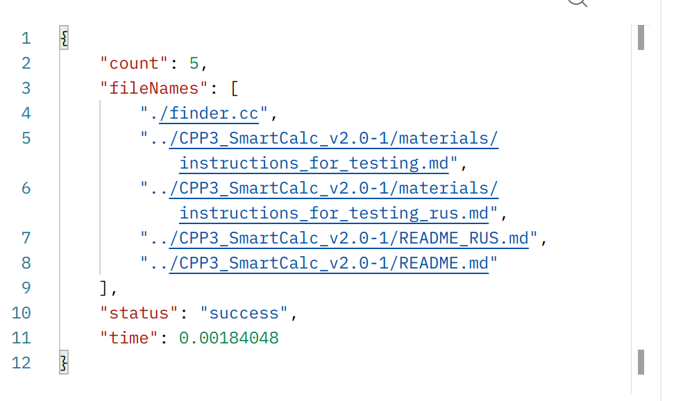
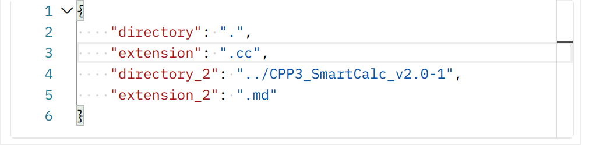

### Finder_API
## API для поиска файлов
Это API предоставляет возможность выполнить поиск файлов в указанной директории по заданному расширению.

## Установка и запуск
Установите необходимые зависимости:

Установите библиотеку cpprestsdk.
Установите компилятор C++ (например, g++).
Установите CMake.
## Клонируйте репозиторий:

bash
Copy code
git clone <URL_репозитория>
Перейдите в директорию проекта:

bash
Copy code
cd <название_директории>
## Соберите проект:

go
Copy code
cmake .
make
## Запустите API сервер:

bash
Copy code
./finder
API сервер будет запущен и будет доступен по адресу http://localhost:5050.

## Использование
API сервер поддерживает только POST запросы. Для использования API, отправьте POST запрос на адрес http://localhost:5050 с JSON-объектом, содержащим параметры запроса.

# Запрос
Отправьте POST запрос на http://localhost:5050 с JSON-объектом, содержащим следующие параметры:

"directory": Строка, указывающая путь к директории, в которой нужно выполнить поиск файлов.
"extension": Строка, указывающая расширение файлов, которые нужно искать.
## Пример запроса:

# json

Ответ
API сервер вернет JSON-объект с результатами поиска файлов. В ответе будет следующая структура:

"status": Строка, указывающая статус выполнения запроса ("success" или "error").
"fileNames": Массив строк, содержащий имена найденных файлов.
"count": Число, общее количество найденных файлов.
"time": Число, время выполнения запроса в секундах.
## Пример ответа:

Если запрос содержит некорректные параметры, сервер вернет JSON-объект с ошибкой:

## Завершение работы
Чтобы остановить API сервер, нажмите клавишу Enter в консоли, где запущен сервер.

## Заметки
Убедитесь, что у вас есть права доступа для чтения файлов в указанной директории.
Проверьте правильность указания пути к директории и расширению файлов.
Если возникают проблемы с сборкой или запуском сервера, убедитесь, что все зависимости установлены корректно.
